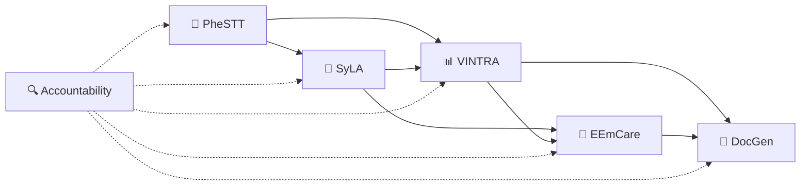
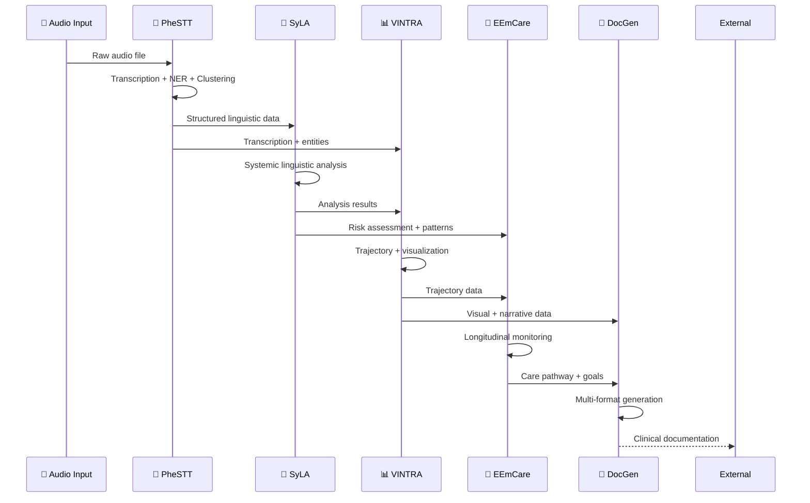

# Arquitetura dos 5 Pipelines ZeoCare/Voither

> **Sistema Integrado de Análise Psiquiátrica Dimensional**  
> Framework de processamento linguístico e análise trajetorial para consultas clínicas

---

## 📑 Índice de Navegação

1. [Visão Geral do Sistema](#1-visão-geral-do-sistema)
2. [Pipeline PheSTT](#2-pipeline-phestt-phenomenological-speech-to-text)
3. [Pipeline SyLA](#3-pipeline-syla-systemic-language-analysis)
4. [Pipeline VINTRA](#4-pipeline-vintra-visualização-integrativa-trajetorial)
5. [Pipeline EEmCare Support](#5-pipeline-eemcare-support-empowering-emergenable-care)
6. [Pipeline DocGen](#6-pipeline-docgen-document-generation)
7. [Integração e Fluxo de Dados](#7-integração-e-fluxo-de-dados)
8. [Accountability Framework](#8-accountability-framework)
9. [Especificações Técnicas](#9-especificações-técnicas)

---

## 1. Visão Geral do Sistema

### Arquitetura de 5 Pipelines Especializados



### Princípios Arquiteturais (Baseados em Industry Standards)

- **Separação de Responsabilidades** ([SOLID Principles](https://en.wikipedia.org/wiki/SOLID))
  - Single Responsibility Principle aplicado a nível de pipeline
  - Cada pipeline tem função específica e bem delimitada
  
- **Interoperabilidade** ([IEEE 1003.1 POSIX](https://standards.ieee.org/standard/1003_1-2017.html))
  - Outputs estruturados JSON Schema compliant
  - REST API seguindo [OpenAPI 3.0](https://spec.openapis.org/oas/v3.0.3) specification
  
- **Accountability** ([ISO/IEC 27001](https://www.iso.org/isoiec-27001-information-security.html))
  - Rastreabilidade completa seguindo NIST Cybersecurity Framework
  - Auditoria em todos os níveis conforme SOX compliance
  
- **Escalabilidade** ([12-Factor App Methodology](https://12factor.net/))
  - Processamento independente e paralelo
  - Horizontal scaling via container orchestration
  
- **Extensibilidade** ([Clean Architecture - Robert Martin](https://blog.cleancoder.com/uncle-bob/2012/08/13/the-clean-architecture.html))
  - Arquitetura hexagonal com ports & adapters
  - Dependency Inversion Principle para modularity

---

## 2. Pipeline PheSTT (Phenomenological Speech-to-Text)

### 🎯 Responsabilidade Principal
**Transcrição fenomenológica + classificação/extração básica de entidades**

### 📦 Módulos Especializados

#### 🎤 **Core Transcription Engine** (já existente)
- **Whisper Large-v3** para transcrição precisa
- **Speaker diarization** (médico/paciente) 
- **Timestamps** de alta precisão
- **Qualidade de áudio** e validação

#### 🏥 **Medical NER++ Specialized**
- **Medicações**: nomes + dosagens + frequência
- **Sintomas**: manifestações clínicas + intensidade
- **Procedimentos**: intervenções + exames
- **Temporal markers**: "há 3 semanas", "desde ontem"
- **Entidades LGPD**: detecção PII para redação

#### 🧬 **Embeddings Engine**
- **Sentence embeddings** para busca semântica
- **Medical embeddings** especializados
- **Similaridade entre segmentos**
- **Indexação vetorial** para recuperação

#### 🔍 **Clustering Engine**
- **Agrupamento automático** de segmentos similares
- **Identificação de temas** recorrentes
- **Segmentação por tópicos** clínicos
- **Detecção de padrões** repetitivos

#### 🏛️ **Ontology Mapping**
- **SNOMED CT**: terminologia médica internacional
- **CID-11**: classificação de doenças
- **RDoC**: research domain criteria
- **Ontologias customizadas** para psiquiatria

#### 📊 **Accountability Engine**
- **Confidence scores** da transcrição
- **Evidence tracking** para cada extração
- **Quality metrics** do áudio
- **Validation flags** para revisão humana

### 📤 **Output Structure**
```json
{
  "transcription": {
    "full_text": "transcrição completa",
    "segments": [
      {
        "speaker": "patient|clinician",
        "text": "segmento de fala",
        "timestamp": "00:01:23-00:01:45",
        "confidence": 0.95
      }
    ]
  },
  "medical_entities": {
    "medications": ["sertralina 50mg", "clonazepam 2mg"],
    "symptoms": ["ansiedade", "insônia"],
    "procedures": ["avalição psiquiátrica"],
    "temporal_markers": ["há 3 semanas", "desde segunda"]
  },
  "embeddings": {
    "sentence_vectors": [[0.1, 0.2, ...], [0.3, 0.4, ...]],
    "medical_vectors": [[0.5, 0.6, ...]]
  },
  "clusters": {
    "thematic_groups": [
      {"theme": "sintomas_ansiosos", "segments": [1, 3, 7]},
      {"theme": "histórico_familiar", "segments": [12, 15]}
    ]
  },
  "ontology_mappings": {
    "snomed": ["anxiety_disorder_300.00"],
    "cid11": ["6B00.0"],
    "rdoc": ["negative_valence_systems"]
  },
  "accountability": {
    "transcription_confidence": 0.94,
    "ner_confidence": 0.87,
    "quality_flags": ["high_audio_quality", "clear_speech"],
    "evidence_mapping": {...}
  }
}
```

---

## 3. Pipeline SyLA (Systemic Language Analysis)

### 🎯 Responsabilidade Principal
**Análises sistêmicas linguísticas profundas + processamento dimensional**

### 📦 Módulos Especializados

#### 📝 **Syntactic Analysis Engine**
- **Parsing morfossintático** avançado
- **Árvores sintáticas** e dependências
- **Complexidade estrutural** (profundidade, subordinação)
- **Análise de coesão** textual
- **Padrões sintáticos** específicos

#### 🧠 **Semantic Analysis Engine**
- **Análise semântica** por camadas
- **Campos conceituais** e domínios
- **Desambiguação** de sentidos
- **Papéis temáticos** (agente, paciente, tema)
- **Redes semânticas** conceituais

#### 💬 **Pragmatic Analysis Engine**
- **Atos de fala** (assertivos, diretivos, expressivos)
- **Inferências pragmáticas** e implicaturas
- **Postura epistêmica** (certeza, dúvida)
- **Marcadores discursivos** e conectivos
- **Análise de modalidade** e evidencialidade

#### 🔗 **Social Network Extraction**
- **Mapeamento de entidades sociais** mencionadas
- **Qualidade das relações** expressas
- **Dinâmicas interpessoais** descritas
- **Padrões de suporte social**
- **Conflitos e cooperação**

#### 📱 **Digital Phenotyping Engine**
- **Padrões temporais** de expressão
- **Variabilidade linguística** ao longo do tempo
- **Assinaturas comportamentais** na linguagem
- **Marcadores digitais** de bem-estar
- **Ritmos circadianos** linguísticos

#### 🔍 **Consistency Analysis Engine**
- **Contradições semânticas** intra e inter-segmentos
- **Dissonância cognitiva** detectada
- **Inconsistências temporais** na narrativa
- **Conflitos valores-comportamentos**
- **Análise de coerência** global

#### ⚠️ **Risk Assessment Engine**
- **Estratificação de risco** multidimensional
- **Marcadores linguísticos** de instabilidade
- **Padrões de deterioração** identificados
- **Fatores protetivos** na linguagem
- **Predição de eventos** adversos

#### 🎯 **10-Dimensional Vector Calculator** (Futuro F#)
- **Placeholder reservado** para implementação em F#
- **Interface definida** para integração futura
- **Especificação das 3 meta-dimensões**
- **Algoritmos algébricos** avançados

#### 📊 **Accountability Engine**
- **Rastreabilidade analítica** completa
- **Justificativas metodológicas** para cada análise
- **Confidence mapping** por módulo
- **Evidence correlation** entre análises

### 📤 **Output Structure**
```json
{
  "syntactic_analysis": {
    "complexity_metrics": {...},
    "dependency_trees": [...],
    "syntactic_patterns": [...]
  },
  "semantic_analysis": {
    "conceptual_fields": [...],
    "semantic_roles": [...],
    "disambiguation_results": [...]
  },
  "pragmatic_analysis": {
    "speech_acts": [...],
    "inference_chains": [...],
    "epistemic_stance": [...]
  },
  "social_network": {
    "social_entities": [...],
    "relationship_quality": [...],
    "interpersonal_dynamics": [...]
  },
  "digital_phenotyping": {
    "temporal_patterns": [...],
    "linguistic_variability": [...],
    "behavioral_signatures": [...]
  },
  "consistency_analysis": {
    "contradictions": [...],
    "cognitive_dissonance": [...],
    "narrative_coherence": [...]
  },
  "risk_assessment": {
    "risk_stratification": {...},
    "risk_prediction": {...},
    "protective_factors": [...]
  },
  "dimensional_placeholder": {
    "status": "reserved_for_fsharp_implementation",
    "interface_spec": {...}
  },
  "accountability": {
    "analysis_confidence": {...},
    "methodological_justifications": {...},
    "evidence_correlation": {...}
  }
}
```

---

## 4. Pipeline VINTRA (Visualização INtegrativa TRAjetorial)

### 🎯 Responsabilidade Principal
**Análise trajetorial dinâmica + integração narrativa + visualização dimensional**

### 📦 Módulos Especializados

#### 📊 **Dimensional Visualization Engine**
- **Radar dimensional** das 10 dimensões
- **Visualizações 3D** do espaço vetorial
- **Projeções dimensionais** interativas
- **Codificação cromática** por meta-dimensão
- **Comparações temporais** visuais

#### 🛤️ **Trajectory Analysis Engine**
- **Análise de trajetórias** no espaço dimensional
- **Pontos críticos** e transições
- **Atratores e repulsores** identificados
- **Padrões de movimento** característicos
- **Predição de trajetórias** futuras

#### ⏰ **Chronological Analysis Engine**
- **Marcos temporais importantes** identificados
- **Sequenciamento de eventos** significativos
- **Periodização** de fases clínicas
- **Análise de durações** e intervalos
- **Correlação temporal** com intervenções

#### 📖 **Narrative Integration Engine**
- **Expressões ipsissima** destacadas
- **Narrativas dissonantes** identificadas
- **Síntese integrativa** de múltiplas versões
- **Temas narrativos** centrais
- **Metáforas recorrentes** e significativas

#### 🔄 **Pattern Evolution Engine**
- **Evolução de padrões** ao longo do tempo
- **Transições de estado** significativas
- **Processos de estabilização**
- **Dinâmicas de mudança**
- **Identificação de ciclos**

#### 🎨 **Interactive Visualization Engine**
- **Dashboard clínico** interativo
- **Interfaces responsivas** multi-device
- **Relatórios visuais** customizáveis
- **Exportação** em múltiplos formatos
- **Colaboração visual** com pacientes

#### 📊 **Accountability Engine**
- **Auditoria trajetorial** completa
- **Evidence mapping** visual
- **Confidence tracking** temporal
- **Validação** de interpretações

### 📤 **Output Structure**
```json
{
  "dimensional_trajectory": {
    "trajectory_points": [...],
    "critical_transitions": [...],
    "movement_patterns": [...]
  },
  "chronological_analysis": {
    "temporal_landmarks": [...],
    "event_sequences": [...],
    "phase_periodization": [...]
  },
  "narrative_integration": {
    "ipsissima_expressions": [...],
    "dissonant_narratives": [...],
    "integrative_synthesis": {...}
  },
  "pattern_evolution": {
    "pattern_changes": [...],
    "stabilization_processes": [...],
    "cyclical_dynamics": [...]
  },
  "visualizations": {
    "radar_charts": [...],
    "3d_trajectories": [...],
    "interactive_dashboards": [...]
  },
  "accountability": {
    "trajectory_confidence": {...},
    "visual_evidence_mapping": {...},
    "interpretation_validation": [...]
  }
}
```

---

## 5. Pipeline EEmCare Support (Empowering-Emergenable Care)

### 🎯 Responsabilidade Principal
**Monitoramento longitudinal + detecção de potencial emergenável + care pathways adaptativos**

### 📦 Módulos Especializados

#### 🌱 **Emergeable Potential Detection**
- **Identificação de potenciais latentes**
- **Recursos não manifestos** detectados
- **Pontos de alavancagem** natural
- **Padrões de autorrecuperação**
- **Capacidades negadas** ou minimizadas

#### 📈 **Longitudinal Monitoring Engine**
- **Acompanhamento contínuo** de múltiplas sessões
- **Evolução dimensional** ao longo do tempo
- **Detecção de tendências** e padrões
- **Alertas automáticos** para mudanças
- **Correlação** com eventos externos

#### 🛣️ **Adaptive Care Pathway Engine**
- **Pathways dinâmicos** baseados em evolução
- **Adaptação automática** de planos
- **Personalização** baseada em perfil
- **Recomendações contextuais**
- **Otimização** de intervenções

#### 🎯 **SMART Goals Generator**
- **Objetivos específicos** baseados em potenciais
- **Métricas mensuráveis** dimensionais
- **Metas alcançáveis** e realísticas
- **Relevância** clínica contextual
- **Temporalidade** definida

#### 💖 **Quality of Life Tracking**
- **Monitoramento de bem-estar** multidimensional
- **Correlações** entre dimensões e QoL
- **Indicadores** de melhoria sustentável
- **Fatores** de proteção e risco
- **Tendências** de longo prazo

#### 🚨 **Early Warning System**
- **Sistema de alertas precoces**
- **Detecção de padrões** preocupantes
- **Intervenção preventiva** automatizada
- **Escalação** para equipe clínica
- **Protocolo de emergência**

#### 📊 **Accountability Engine**
- **Auditoria longitudinal** completa
- **Tracking de decisões** automatizadas
- **Correlação** outcome-intervenção
- **Validação** de predições

### 📤 **Output Structure**
```json
{
  "emergeable_potential": {
    "latent_resources": [...],
    "leverage_points": [...],
    "self_recovery_patterns": [...]
  },
  "longitudinal_monitoring": {
    "evolution_trends": [...],
    "pattern_detection": [...],
    "automated_alerts": [...]
  },
  "adaptive_pathways": {
    "dynamic_plans": [...],
    "adaptation_rationale": [...],
    "personalization_factors": [...]
  },
  "smart_goals": {
    "specific_objectives": [...],
    "measurable_metrics": [...],
    "timeline_definitions": [...]
  },
  "quality_of_life": {
    "wellbeing_indicators": [...],
    "dimensional_correlations": [...],
    "sustainability_factors": [...]
  },
  "early_warnings": {
    "alert_triggers": [...],
    "risk_patterns": [...],
    "intervention_recommendations": [...]
  },
  "accountability": {
    "longitudinal_audit": {...},
    "decision_tracking": {...},
    "outcome_correlation": [...]
  }
}
```

---

## 6. Pipeline DocGen (Document Generation)

### 🎯 Responsabilidade Principal
**Geração de documentação clínica multi-formato + interoperabilidade**

### 📦 Módulos Especializados

#### 📝 **RCD Generator (Registro Clínico Dimensional)**
- **Documentação estruturada** completa
- **5 seções padronizadas** (Narrativa, Dimensionalização, Trajetória, Análise Integrativa, Resposta Terapêutica)
- **Templates dinâmicos** adaptativos
- **Geração automatizada** com validação

#### 🏥 **SOAP-t Generator (SOAP Trajetorial)**
- **Formato SOAP** adaptado para análise dimensional
- **Subjetivo**: narrativa ipsissima + contexto
- **Objetivo**: achados dimensionais + trajetória
- **Avaliação**: síntese integrativa + hipóteses
- **Plano**: intervenções dimensionais + monitoramento

#### 📋 **STAMP Generator (Systematic Trajectory Assessment)**
- **Protocolo estruturado** de avaliação trajetorial
- **Assessment sistemático** de evolução
- **Monitoramento padronizado**
- **Métricas** de progresso
- **Template** para seguimento

#### 💊 **Prescription Generator**
- **Receitas estruturadas** com justificativa dimensional
- **Dosagens** baseadas em perfil
- **Interações** medicamentosas
- **Monitoramento** de efeitos
- **Compliance** regulatório

#### 📄 **Report Generator**
- **Laudos especializados** para diferentes contextos
- **Relatórios de pesquisa** com dados agregados
- **Documentos regulatórios** (LGPD, ética)
- **Sumários executivos** para equipes
- **Comunicação** inter-profissional

#### 🔗 **Interoperability Engine**
- **HL7 FHIR** compliance completo
- **Integração** com sistemas externos
- **Exports** em múltiplos formatos
- **APIs** padronizadas
- **Sincronização** de dados

#### 📊 **Accountability Engine**
- **Auditoria documental** completa
- **Version control** automático
- **Compliance tracking**
- **Digital signatures**
- **Timestamp** criptográfico

### 📤 **Output Structure**
```json
{
  "rcd_document": {
    "narrative_section": {...},
    "dimensionalization": {...},
    "trajectory_analysis": {...},
    "integrative_analysis": {...},
    "therapeutic_response": {...}
  },
  "soap_t_document": {
    "subjective": {...},
    "objective": {...},
    "assessment": {...},
    "plan": {...}
  },
  "stamp_document": {
    "systematic_assessment": {...},
    "trajectory_monitoring": {...},
    "progress_metrics": [...]
  },
  "prescriptions": {
    "medications": [...],
    "dosage_rationale": [...],
    "monitoring_plan": [...]
  },
  "reports": {
    "clinical_reports": [...],
    "research_summaries": [...],
    "regulatory_documents": [...]
  },
  "interoperability_exports": {
    "fhir_bundles": [...],
    "system_integrations": [...],
    "api_endpoints": [...]
  },
  "accountability": {
    "document_audit": {...},
    "version_control": {...},
    "compliance_validation": [...]
  }
}
```

---

## 7. Integração e Fluxo de Dados

### Arquitetura de Comunicação



### Padrões de Integração

#### **Event-Driven Architecture** ([CQRS Pattern - Greg Young](https://cqrs.files.wordpress.com/2010/11/cqrs_documents.pdf))
- **Eventos assíncronos** entre pipelines seguindo [CloudEvents CNCF spec](https://cloudevents.io/)
- **Message queues** implementando [AMQP 0.9.1](https://www.rabbitmq.com/resources/specs/amqp0-9-1.pdf)
- **Event sourcing** conforme [Event Store patterns](https://eventstore.com/blog/what-is-event-sourcing/)
- **Saga pattern** para transações distribuídas ([Microservices.io](https://microservices.io/patterns/data/saga.html))

#### **API-First Design** ([OpenAPI Initiative](https://www.openapis.org/))
- **REST APIs** Level 3 Richardson Maturity Model
- **GraphQL** seguindo [GraphQL Specification](https://spec.graphql.org/)
- **WebHooks** implementando [Webhook Standard](https://github.com/webhooks/webhooks.org)
- **Rate limiting** via [Token Bucket Algorithm](https://en.wikipedia.org/wiki/Token_bucket)

#### **Data Flow Patterns** ([Enterprise Integration Patterns - Hohpe](https://www.enterpriseintegrationpatterns.com/))
- **Pipeline paralelo** usando [Parallel Processing Pattern](https://www.enterpriseintegrationpatterns.com/patterns/messaging/ParallelProcessing.html)
- **Dependency management** via [Dependency Injection](https://martinfowler.com/articles/injection.html)
- **Error handling** seguindo [Circuit Breaker Pattern](https://martinfowler.com/bliki/CircuitBreaker.html)
- **Retry mechanisms** implementando [Exponential Backoff](https://en.wikipedia.org/wiki/Exponential_backoff)

---

## 8. Accountability Framework

### Princípios de Accountability

#### **🔍 Transparency**
- **Rastreabilidade completa** de todas as operações
- **Evidence mapping** para cada decisão
- **Confidence scores** em todos os outputs
- **Method justification** para análises

#### **📊 Auditability**
- **Logs estruturados** em todos os pipelines
- **Version control** para dados e modelos
- **Timestamp** criptográfico
- **Digital signatures** para integridade

#### **🎯 Explainability**
- **XAI integration** via GenAIScript
- **Human-readable** explanations
- **Visual evidence** mapping
- **Interactive exploration** de resultados

#### **⚖️ Compliance**
- **LGPD compliance** nativo
- **Medical regulations** adherence
- **Ethical guidelines** enforcement
- **Data governance** automático

### Implementação Técnica

```python
# Implementação seguindo Clean Code (Robert Martin) e SOLID Principles
from abc import ABC, abstractmethod
from typing import Dict, Any, Optional
from dataclasses import dataclass
import hashlib
import hmac
from datetime import datetime, timezone

@dataclass
class AuditEntry:
    """Immutable audit entry following Value Object pattern (DDD)"""
    timestamp: datetime
    pipeline: str
    module: str
    input_hash: str
    output_hash: str
    confidence_score: float
    evidence_trail: Dict[str, Any]
    method_justification: str
    digital_signature: str

class AccountabilityEngine:
    """
    Accountability engine following Single Responsibility Principle
    Implements audit trail patterns from NIST Cybersecurity Framework
    """
    
    def __init__(self, signature_key: bytes):
        self.signature_key = signature_key
    
    def track_operation(
        self, 
        pipeline: str, 
        module: str, 
        input_data: Any, 
        output_data: Any
    ) -> AuditEntry:
        """
        Creates immutable audit entry with cryptographic signature
        Following ISO/IEC 27001 audit requirements
        """
        audit_entry = AuditEntry(
            timestamp=datetime.now(timezone.utc),  # ISO 8601 compliant
            pipeline=pipeline,
            module=module,
            input_hash=self._secure_hash(input_data),  # SHA-256
            output_hash=self._secure_hash(output_data),
            confidence_score=self._calculate_confidence(output_data),
            evidence_trail=self._extract_evidence(input_data, output_data),
            method_justification=self._get_method_rationale(module),
            digital_signature=self._sign_operation(audit_entry)  # HMAC-SHA256
        )
        
        self._store_audit_entry(audit_entry)
        return audit_entry
    
    def _secure_hash(self, data: Any) -> str:
        """SHA-256 hash following FIPS 180-4 standard"""
        return hashlib.sha256(str(data).encode()).hexdigest()
    
    def _sign_operation(self, entry: AuditEntry) -> str:
        """HMAC-SHA256 signature following RFC 2104"""
        message = f"{entry.timestamp}{entry.pipeline}{entry.module}"
        return hmac.new(
            self.signature_key, 
            message.encode(), 
            hashlib.sha256
        ).hexdigest()
```

---

## 9. Especificações Técnicas

### Stack Tecnológico Recomendado

#### **Backend**
- **Python 3.11+**: Runtime principal para análises
- **FastAPI**: APIs REST de alta performance
- **Pydantic**: Validação de dados e serialização
- **SQLAlchemy**: ORM para persistência
- **Redis**: Cache e message broker
- **PostgreSQL**: Banco de dados principal

#### **AI/ML**
- **OpenAI Whisper**: Transcrição de áudio
- **spaCy**: Processamento de linguagem natural
- **Transformers**: Modelos de linguagem
- **scikit-learn**: Machine learning clássico
- **PyTorch**: Deep learning quando necessário

#### **Visualização**
- **React/TypeScript**: Frontend interativo
- **D3.js**: Visualizações customizadas
- **Chart.js**: Gráficos padronizados
- **Three.js**: Visualizações 3D

#### **Infraestrutura**
- **Docker**: Containerização
- **Kubernetes**: Orquestração
- **Azure/AWS**: Cloud provider
- **GitHub Actions**: CI/CD
- **OpenTelemetry**: Observabilidade

### Patterns Arquiteturais

#### **Microservices** ([Building Microservices - Sam Newman](https://samnewman.io/books/building_microservices/))
- **Um pipeline = um serviço** seguindo [Domain-Driven Design](https://martinfowler.com/bliki/DomainDrivenDesign.html)
- **API Gateway** implementando [Backend for Frontend Pattern](https://samnewman.io/patterns/architectural/bff/)
- **Service mesh** via [Istio](https://istio.io/) ou [Linkerd](https://linkerd.io/)
- **Circuit breakers** seguindo [Netflix Hystrix patterns](https://github.com/Netflix/Hystrix/wiki)

#### **Event Sourcing** ([Event Sourcing - Martin Fowler](https://martinfowler.com/eaaDev/EventSourcing.html))
- **Eventos imutáveis** para auditoria conforme [Immutable Infrastructure](https://www.oreilly.com/library/view/infrastructure-as-code/9781491924334/ch04.html)
- **Event store** implementando [EventStore](https://eventstore.com/) ou [Apache Kafka](https://kafka.apache.org/)
- **Projections** para read models otimizados
- **Snapshots** seguindo [Snapshot Pattern](https://microservices.io/patterns/data/event-sourcing.html)

#### **CQRS** ([CQRS Journey - Microsoft](https://docs.microsoft.com/en-us/previous-versions/msp-n-p/jj554200(v=pandp.10)))
- **Write models** otimizados para command handling
- **Read models** otimizados para query performance
- **Eventual consistency** via [BASE properties](https://en.wikipedia.org/wiki/Eventual_consistency)
- **Domain events** seguindo [DDD Aggregates](https://martinfowler.com/bliki/DDD_Aggregate.html)

---

## 🔄 Próximos Passos

1. **Implementação por Pipeline**: Começar com PheSTT expandido
2. **Interfaces de Integração**: Definir contratos entre pipelines
3. **Accountability Implementation**: Framework transversal
4. **Testing Strategy**: Testes unitários e integração
5. **Documentation**: Especificações técnicas detalhadas

---

*Este documento serve como blueprint arquitetural para o sistema ZeoCare/Voither. Cada pipeline será detalhado em documentos específicos com implementações concretas.*

---

**Documento aberto no editor conforme solicitado**